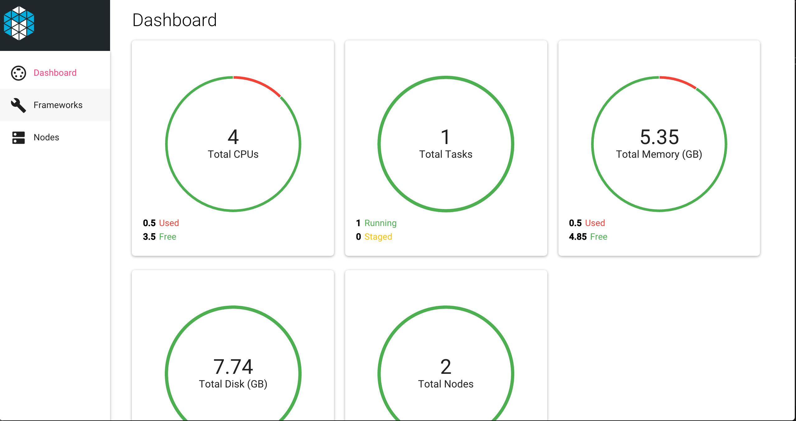

# Mesos UI

[](https://app.wercker.com/project/bykey/3e566621ba967bfeb6ee57a76ddf42cc)

A responsive, realtime dashboard for Apache Mesos built using Node.js, React.js and Socket.io.



## Compatibility

This code has been tested against Mesos version 0.23 at the time of writing.

## Developing locally

### Prerequisites

NodeJS (+ NPM) version 4.x. See [https://nodejs.org/en/download/releases/](https://nodejs.org/en/download/releases/) for installation instructions.

Install gulp package for global use:

```
sudo npm install -g gulp
```

To run the app, first clone the repo:

```
git clone https://github.com/Capgemini/mesos-ui.git mesos-ui
```

Install the NPM packages:

```
cd mesos-ui
npm install
```

Serve the app

```
gulp
```

At this point the app should open in the browser the page `http://localhost:3000`.

By default the application is using a stub JSON server to mock the Mesos APIs
so you don't necessarily need a working Mesos Cluster. For that we are using
[json-server](https://github.com/typicode/json-server).

## Usage

### Building the Docker container

```
docker build .
```

### Running the Docker container

```
docker run -p 5000:5000 -p 8000:8000 -v /var/run/docker.sock:/var/run/docker.sock capgemini/mesos-ui
```

The application should be available on http://localhost:5000.

The stub data is at [src/stub.json](https://github.com/Capgemini/mesos-ui/blob/master/src/stub.json). The UI for json-server should be available on http://localhost:8000

#### Pointing the container at live cluster endpoints

The UI can be pointed at the real APIs by providing an environment variables to the
container as follows:

```
docker run -p 5000:5000 -v /var/run/docker.sock:/var/run/docker.sock -e MESOS_ENDPOINT=http://production_endpoint:5050 capgemini/mesos-ui
```
