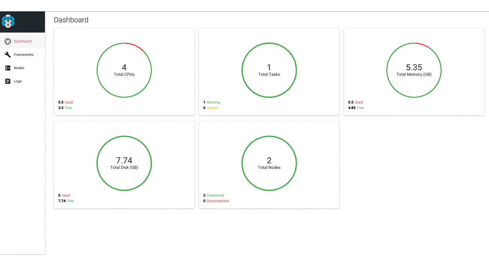

# Mesos UI

[](https://gitter.im/Capgemini/mesos-ui?utm_source=badge&utm_medium=badge&utm_campaign=pr-badge&utm_content=badge)

[](https://app.wercker.com/project/bykey/3e566621ba967bfeb6ee57a76ddf42cc)
[](https://codeclimate.com/repos/5613e8d3e30ba0426b004fdb/feed)
[](https://codeclimate.com/repos/5613e8d3e30ba0426b004fdb/coverage)

A responsive, realtime dashboard for Apache Mesos built using Node.js, React.js and Socket.io.



## Replacing Mesos default UI

Run:
```
git clone https://github.com/Capgemini/mesos-ui.git mesos-ui
cd mesos-ui
npm install
export MESOS_UI_BUILD_TYPE=mesos-server
gulp build
```

Test it with Mesos overriding the default UI e.g:

```./bin/mesos-master.sh --ip=127.0.0.1 --work_dir=/var/lib/mesos --log_dir=/var/lib/mesos/logs --webui_dir=/path-to/mesos-ui/build/```

or using environment variables:

```export MESOS_WEBUI_DIR=/your-path/mesos-ui/build/```

See http://mesos.apache.org/gettingstarted/

See http://mesos.apache.org/documentation/latest/configuration/

## Compatibility

This code has been tested against Mesos version 0.23 at the time of writing.

## Developing locally

At the moment two flavors of the Mesos UI coexist in this repo:

* Standalone

This provides a standalone app served by nodejs.
Nodejs server requests Mesos periodically and comunicates with mesos-ui client via sockets.

* Mesos server

This generates the static files ready to be run a as default UI served by Mesos core.

Run
```
export MESOS_UI_BUILD_TYPE=mesos-server
gulp build
```

Make sure you set ```--webui_dir=/path-to/mesos-ui/build/``` or ```export MESOS_WEBUI_DIR=/your-path/mesos-ui/build/``` when runing Mesos.

### Prerequisites

NodeJS (+ NPM) version 4.x. See [https://nodejs.org/en/download/releases/](https://nodejs.org/en/download/releases/) for installation instructions.

Install gulp package for global use:

```
sudo npm install -g gulp
```

To run the app, first clone the repo:

```
git clone https://github.com/Capgemini/mesos-ui.git mesos-ui
```

Install the NPM packages:

```
cd mesos-ui
npm install
```

Serve the app

```
gulp
```

At this point the app should open in the browser the page `http://localhost:3000`.

By default the application is using a stub JSON server to mock the Mesos APIs
so you don't necessarily need a working Mesos Cluster. For that we are using
[json-server](https://github.com/typicode/json-server).

## Usage

### Deploying the UI through Marathon

Edit ```marathon.json``` and replace ```MESOS_ENDPOINT``` with the URL of your
Mesos master, and adjust the cpu or memory if desired, and then execute -

```
curl -X POST -HContent-Type:application/json -d @marathon.json http://MARATHON_ENDPOINT:8080/v2/apps
```

### Building the Docker container

```
docker build .
```

### Running the Docker container

```
docker run -p 5000:5000 -p 8000:8000 capgemini/mesos-ui
```

The application should be available on http://localhost:5000.

The stub data is at [src/stub.json](https://github.com/Capgemini/mesos-ui/blob/master/src/stub.json). The UI for json-server should be available on http://localhost:8000

#### Pointing the container at live cluster endpoints

The UI can be pointed at the real APIs by providing an environment variables to the
container as follows:

```
docker run -p 5000:5000 -e MESOS_ENDPOINT=http://production_endpoint:5050 capgemini/mesos-ui
```
